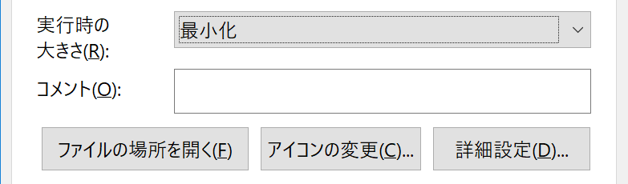
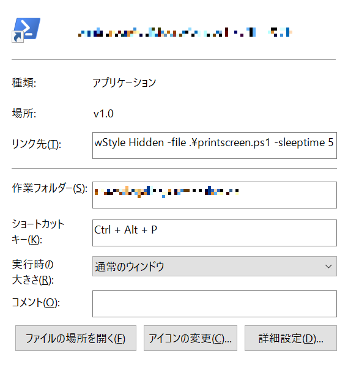
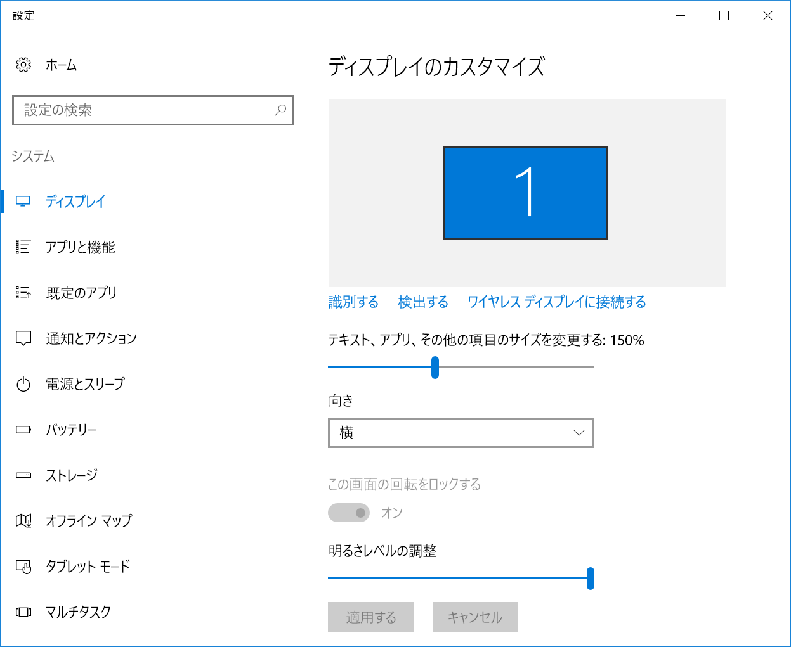
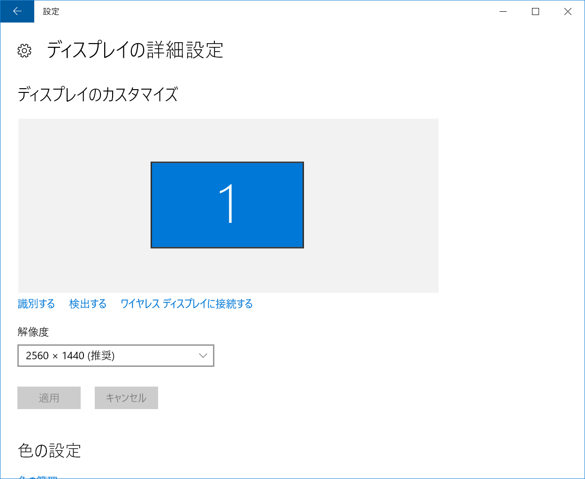

# 💎powershellでスクリーンショットを取るやつ

## 💎スクリプト名 :Get-PrintScreen.ps1

実行するとディスプレイサイズを取得して全画面のスクリーンショットを取得する。  
出力するフォルダは引数による（デフォルトはスクリプトが格納されている同フォルダ）  
出力ファイル名はyyyyMMdd_HHmmssfff  
出力形式は引数による（デフォルトはpng)  

※注意事項

一応、文字のスケーリングを使用している場合とかでもスクリーンショットが取れるような感じになっている筈。

マルチディスプレイには対応してません。プライマリのモニタスクリーンショットを取る筈。
powrshell_ise.exeだとうまく実行できません。[備考参照](#備考)

## 💎基本的な使い方

Get-PrintScreen.ps1のショートカットを作成して、そのショートカットをデスクトップに置く

（ショートカットのショートカットキーが有効なのがデスクトップのみなので）

作成したショートカットファイルを下記に従って編集する。

### 💎リンク先

サンプル1

```cmd
powershell.exe -WindowStyle Hidden -command "&{. .\Get-PrintScreen.ps1;Get-PrintScreen}"
```

引数を指定する場合は

サンプル2

```cmd
powershell.exe -WindowStyle Hidden -command "&{. .\Get-PrintScreen.ps1;Get-PrintScreen -SleepTime 5}"
```

やっている事はpowershell.exeに引数を与えてスクリプトをドットソースで読み込んで関数Get-PrintScreenを実行している。

powershell.exeの引数

windowstyle引数で hidden を指定するのはすぐにウィンドウが閉じるように（これをやらないとスクリーンショット取得時にコンソールが映り込む）

▶WindowsStyle Hiddenを使わないで実行時の大きさを最小化にしても写り込まないかも。  


command　引数でスクリプトブロックを利用してドットソースでps1ファイルの読み込みから関数の呼び出しを実行する。

"&{. .\Get-PrintScreen.ps1;Get-PrintScreen -SleepTime 5}"

### 💎作業フォルダ

スクリプトが格納されているフォルダ

### 💎ショートカットキー

お好きなやつ

## 💎使い方一例

▶リンク先にpowershell.exe -WindowStyle Hidden -command "&{. .\Get-PrintScreen.ps1;Get-PrintScreen}"  


作業フォルダにスクリプトが格納されているフォルダ

ショートカットキーに使いたいショートカットキーを入力する

### 💎注意点

ショートカットはデスクトップに配置して下さい。
他の場所だとショートカットキーが有効になりません。

## 引数一覧

| 引数             | 説明                                    | デフォルト値                      |
|----------------|---------------------------------------|-----------------------------|
| -SleepTime     | [int] 指定秒まってからスクリーンショットの取得            | ０                           |
| -SaveDir       | スクリーンショット保存ディレクトリ                     | Get-PrintScreen.ps1格納ディレクトリ |
| -isMsgBox      | [boolean]スクリーンショット取得後にOKのメッセージボックスを表示 | $True                       |
| -isMouseCursor | [boolean]スクリーンショットにマウスカーソルを含める        | $True                       |
| -Format        | 保存形式の指定（拡張子になります）                     | png                         |

## 備考

.NetのSystemInformationクラスのPrimaryMonitorSizeプロパティのメモ

powershell.exeで文字のスケーリングやRDP接続の環境下では該当プロパティではその物ズバリの画面サイズを返してくれない模様。
ただしpowershell_ise.exeで実行すると持ってこれてるみたい。

とりえあずスケーリングを利用している場合。
powershell.exeとpowershell_ise.exeで帰ってくる値が異なるのは知らないと嵌りそうなので注意。
（powershell_ise.exeでコーディングしてて、powershell.exeで実際に動かしたら挙動が違って少し嵌った！）

このスクリプトはpowershell.exeで画面サイズを取得してスケーリングの倍率を掛け算するロジックで画面サイズを取得していますが。

該当スクリプトをpowershell_ise.exeで動かすと、すでにスケーリングされた画像サイズにさらにスケーリングの倍率を掛け算して正しい画面サイズを取得できません。

exsample

スケーリング150%で2560x1440の時に

▶スケーリング150%  


▶解像度2560x1440  


```powershell
[System.Windows.Forms.SystemInformation]::PrimaryMonitorSize
```

を実行すると

powershell.exe

| IsEmpty | Width | Height |
|---------|-------|--------|
| False   | 1707  | 960    |

powershell_ise.exe

| IsEmpty | Width | Height |
|---------|-------|--------|
| False   | 2560  | 1440   |

こんな感じで取得されるサイズが変わる。
多分、powershell_ise.exeだと色々とやっているのだろうかと思うが……
直接の原因が何かまではまだ調査できていない。
